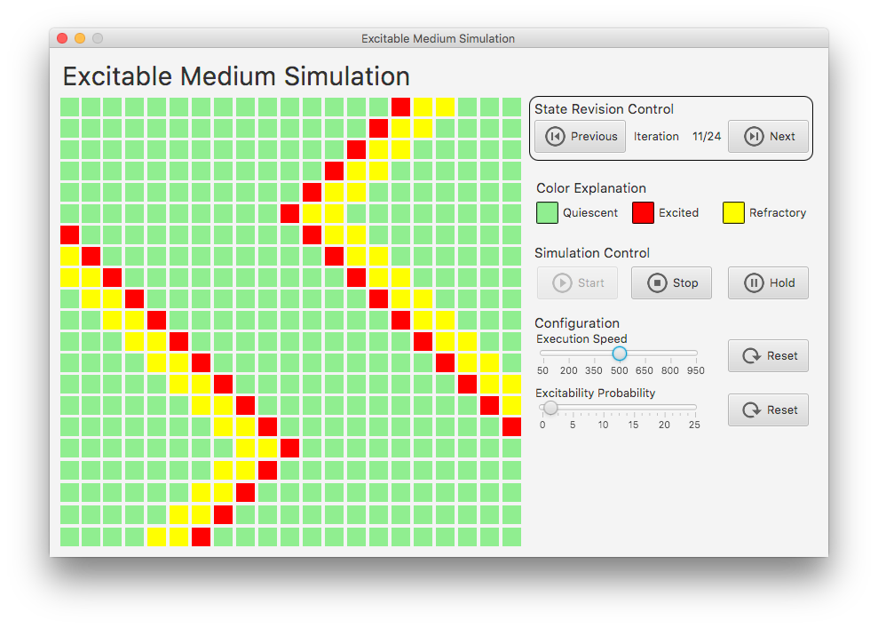

# Excitable Medium Simulation

## General Information
An excitable medium is a non-linear dynamical system which has the capacity to propagate a
wave of some description, and which cannot support the passing of another wave until a
certain amount of time has passed (known as the _refractory time_).

Here you can see how the cells evolve in an example execution:


## Rules of cell development
Each cell of the automaton is made to represent some section of the medium being modelled.
Each cell can be in one of the three following states:
* **Quiescent** or **excitable** – the cell is unexcited, but can be excited. 
* **Excited** - the cell is excited.
* **Refractory** - the cell has recently been excited and is temporarily not excitable.

As in all cellular automata, the state of a particular cell in the next time step depends
on the state of the cells around it - its neighbours - at the current time. If a cell is
quiescent, then it remains quiescent unless one or more of its neighbours is excited. If a
cell is excited, it becomes refractory at the next iteration. If a cell is refractory,
then its remaining refractory period is lessened at the next period, until it reaches
the end of the refractory period and becomes excitable once more.

## Features
These and more characteristics are provided by this simulation:
* graphical surface using [JavaFX](http://www.oracle.com/technetwork/java/javafx/overview/index.html)
* review of all development phases using the _State Revision Control_ panel
* configuration options (excitability probability and execution speed)
* dynamic simulation control using the buttons `Start`, `Stop` and `Hold`
* display of information about the current state of the simulation

## Usage
First ensure you have a valid Java installation. The Java 8 runtime environment or any
newer version is recommended. To start the application, simply start the script
```batch
C:\...> startSimulation.bat
```
on Windows or alternatively the script
```bash
$ ./startSimulation.sh
```
on UNIX systems. Make sure you start the script directly from the root folder of this
project.
